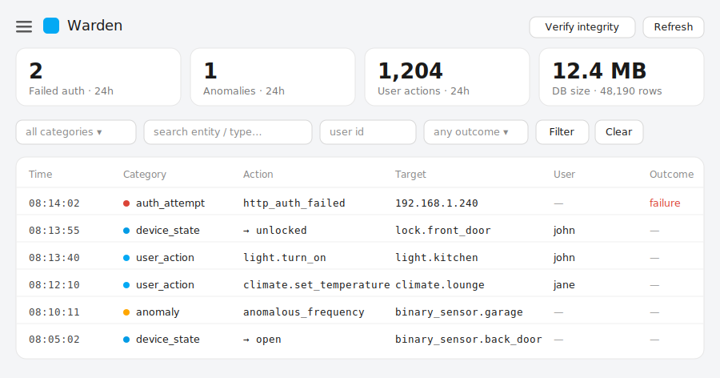

# Warden for Home Assistant

A Home Assistant custom integration for structured, tamper-evident security
event logging: failed/successful auth attempts, who-did-what user action
attribution, and anomalous device behaviour detection - things the built-in
Logbook doesn't give you.

> **Status: early scaffold.** This is a working v0.1 skeleton, not a
> finished product. It compiles, the storage/anomaly logic is unit-tested
> in isolation, but it has not been run inside a live Home Assistant
> instance yet. See `docs/ROADMAP.md` for what's implemented vs. planned,
> and `docs/ARCHITECTURE.md` for the reasoning behind the design choices.

## What this does today

- **User action logging** - every service call is logged with the calling
  user's ID (via HA's built-in `Context` object), the service, and a
  redacted copy of the service data.
- **Device state logging** - state changes for entities you configure
  (by domain, e.g. `lock`, `alarm_control_panel`, or device_class, e.g.
  `door`, `window`, `motion`) are logged with before/after state.
- **Failed auth attempts** - captured by attaching a log handler to HA's
  existing ban-log warnings, giving you source IP and requested URL.
- **Anomaly detection** - a simple, explainable per-entity/per-hour
  frequency baseline that flags statistically unusual activity.
- **Tamper-evident storage** - rows are hash-chained *per category*; a
  `verify_integrity` service recomputes the chains and reports, per category,
  the verifiable range and whether it's been altered.
- **Bounded, tiered retention** - a daily job auto-expires events on a
  two-tier schedule (high-volume activity like device state expires fast;
  security events like auth failures and anomalies are kept long) with a
  hard database-size backstop, so the log doesn't grow without limit.
- **Buffered writes** - events are batched in memory and flushed together
  (by count or time), rather than one database commit per event.
- **Sidebar panel** - an admin-only full-page UI with stat tiles, a
  filtered/paginated event table, row detail, and an integrity check.
- Sensors (24h counts + a Recent Events sensor) and three services
  (`query_events`, `verify_integrity`, `purge_old`) for interacting with the
  log.

## What this does NOT do yet

- **Successful login capture.** HA doesn't expose this today without
  deeper hooks into the auth provider. This is flagged explicitly in
  `auth_listener.py` and tracked as a Phase 2 item - don't assume it works.
- **A dedicated frontend panel/dashboard.** For now, use the
  `warden.query_events` service (Developer Tools -> Actions) or
  build a Lovelace card around it. A proper panel is Phase 2.
- Long-term archival/export tooling beyond the raw SQLite file.

## Repository layout

```
custom_components/warden/   The actual HA integration
  __init__.py        Setup/teardown, listener wiring, service registration
  manifest.json       HA integration manifest
  const.py             Config keys, defaults, event category constants
  config_flow.py       UI setup + options flow
  storage.py            Per-category hash-chained SQLite storage + retention
  buffer.py             In-memory write buffer (batches events before persisting)
  anomaly.py            Per-entity baseline / z-score anomaly detection
  history.py            Rebuilds anomaly baselines from the log on startup
  event_listener.py    Service-call + state-change listeners (user actions, device state)
  auth_listener.py      Failed-auth capture via HA's ban logger
  websocket.py          Admin-only WebSocket API backing the panel
  panel/warden-panel.js  Sidebar panel web component (no build step)
  sensor.py              Rolling 24h count sensors + Recent Events sensor
  services.yaml          Service definitions (shows up in HA's UI)
  strings.json / translations/en.json   Config flow UI text
tests/                  Pure-Python tests for storage/anomaly/history
                        (no HA runtime needed: `pytest tests/`)
docs/
  ARCHITECTURE.md      Design rationale, tradeoffs, what's log-scraped vs. API-based
  ROADMAP.md           Phased plan, what's done / next / later
  SETUP.md              How to install this for local development against a real HA instance
hacs.json               Makes this repo installable via HACS as a custom repository
```

## Quick install (for testing against a real Home Assistant instance)

1. Copy `custom_components/warden/` into your HA config's
   `custom_components/` directory (or add this repo to HACS as a custom
   repository - see `docs/SETUP.md`).
2. Restart Home Assistant.
3. Settings -> Devices & Services -> Add Integration -> "Warden".
4. Choose which domains/device classes to monitor.
5. Try it: Developer Tools -> Actions -> `warden.query_events`.

See `docs/SETUP.md` for the full local development workflow, including
running against a local HA instance in a virtualenv/devcontainer.

## Viewing the log

**Sidebar panel (primary).** Warden registers an admin-only **Warden** item
in the HA sidebar - a full-page, mobile-friendly panel with stat tiles, a
filtered and paginated event table, expand-to-detail rows (the full event
`data` plus the context chain), and a "Verify integrity" button. It's backed
by an admin-only WebSocket API (`websocket.py`) and a single no-build web
component (`panel/warden-panel.js`); see `docs/PANEL.md`.



*Illustrative mockup, not a live capture. The `Action`/`Target` columns are
derived per row (e.g. `light.turn_on` → `light.kitchen` for a service call,
`→ unlocked` for a state change, source IP for a failed login), and the
`User` column shows the resolved username rather than a raw user-id UUID.*

**Dashboard card (optional).** For an at-a-glance view on your own dashboard,
the `Warden Recent Events` sensor exposes the latest rows as an attribute, so
a built-in **Markdown** card can render them as a table - no custom (HACS
frontend) cards required. Add this as a manual card (adjust the entity IDs if
yours differ):

```yaml
type: vertical-stack
cards:
  - type: entities
    title: Warden
    entities:
      - entity: sensor.warden_failed_auth_attempts_24h
      - entity: sensor.warden_detected_anomalies_24h
      - entity: sensor.warden_user_actions_24h
  - type: markdown
    content: |
      ## Recent events

      | Time | Category | Type | Entity | User | Outcome |
      | --- | --- | --- | --- | --- | --- |
      
      | {{ e.time }} | {{ e.category }} | {{ e.type }} | {{ e.entity or '—' }} | {{ e.user[-8:] if e.user else '—' }} | {{ e.outcome or '—' }} |
      
```

The table refreshes every 5 minutes (the sensor's scan interval) and shows
the 20 most recent events. For full search/filtering, use the
`warden.query_events` action (Developer Tools -> Actions).

## Security design notes (read before relying on this)

- **We do not log entered passwords**, even for failed attempts. Logging
  failed-password contents risks capturing a legitimate user's real
  password when they mistype it, turning the security log itself into a
  thing worth attacking. See `docs/ARCHITECTURE.md`.
- The hash chain gives you **tamper evidence, not tamper prevention** -
  it tells you if historical rows were altered after the fact; it does not
  stop someone with filesystem access from editing the DB. Pair it with
  normal file permission hygiene and backups.
- **Retention re-anchors the chains, and that's expected.** Any purge
  (the daily retention job, the size-cap backstop, or the manual
  `purge_old` service) deletes the oldest rows of a category, so the
  surviving chain no longer links back to genesis. `verify_integrity`
  reports this as `anchored_to_genesis: false`, *not* as tampering, and
  each purge is itself recorded as an auditable `maintenance` event. It
  still can't detect deletion of the very oldest rows - if you need
  tamper-evidence across purges, export+archive (or publish a checkpoint
  hash off-box) before pruning. See `docs/ARCHITECTURE.md`.
- **Storage/flash wear.** The log writes continuously (batched, but still
  a steady stream on a busy install). On an SSD this is a non-issue; on a
  Raspberry Pi running from an **SD card or eMMC**, sustained writes
  accelerate flash wear. If that's your setup, narrow the monitored
  domains/device classes, keep retention modest, and consider putting the
  database on external/USB-SSD storage via the `db_path` option.

## License

Pick one before publishing - MIT or Apache-2.0 are the norm for HACS
integrations. Not included yet.
